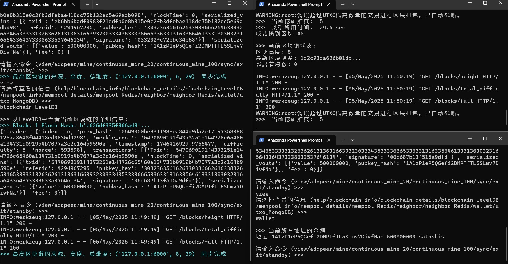

# COMP5521_Project

COMP5521 DISTRIBUTED LEDGER  TECHNOLOGY, CRYPTOCURRENCY AND EPAYMENT Project Specification   

### Objective:

Have an in-depth understanding on how the blockchain system works.  
Be able to write a UTXO (unspent transaction output) blockchain platform. 

### Goals

1. Blockchain Prototype: construct the blockchain system according to the 
   following structure. The block should have the following basic content. 
   a) Index: the height of the current block. 
   b) Timestamp. 
   c) Previous Block Hash. 
   d) Current Block Hash. e) Difficulty: the number of bits at the beginning of block hash, dynamic 
   change. 
   f) Nonce: the random number used to calculate the block hash. 
   g) Merkle root of transactions. 
   h) Data: transaction. 
2. Mining and UTXO: implement a dynamic-difficulty Proof-of-Work algorithm. 
   a) Design a Proof-of-Work algorithm. For example, adjust the nonce and 
   generate a hash until it has a hash with a leading number of zeros. 
   b) Achieve dynamic difficulty. For example, adjusting the difficulty of the 
   current block dynamically based on the time taken to generate the 
   previous (10, 20, or more) blocks. 
3. Transaction: implement pay-to-public-key-hash (P2PKH) transactions and 
   verify transactions. 
   a) Implement pay-to-public-key-hash (P2PKH) transactions. 
   b) Use asymmetric cryptography to create digital signatures and verify 
   transactions. 
4. Network: basic interactions and validation should be realized. 
   a) Create an API to broadcast the new blocks and get the blocks from the 
   other nodes. The API should allow a user to interact with the blockchain 
   by the HTTP request, socket, or different ports. 
   b) Achieve a function to check if the new blocks that we receive from other 
   miners are valid or not. (Hint: recompute the hash of the block and 
   compare it with the given hash of the block.) 
5. Storage: choose your database in the implementation. 
   a) Store the raw data of the whole blockchain in the disk. 
   b) Store the latest state (e.g., chain height, full node list, neighbor list) of the 
   blockchain in memory. 
   c) Store the transactions (UTXO) in a transaction pool. 
6. Wallet: manage all transactions that you can spend. 
   You could refer to some open-source projects to implement your blockchain 
   system but you must refer to them in your report. Otherwise, it could be seen as 
   plagiarism. 


### 项目描述

COMP5521分布式账本技术、加密货币和电子支付 期末项目介绍。

深入了解区块链系统的工作原理。能够编写一个UTXO（未花费交易输出）区块链平台。

区块链原型: 根据以下结构构建区块链系统。区块应包含以下基本内容。a) 索引：当前区块的高度。b) 时间戳。c) 上一个区块哈希。d) 当前区块哈希。e) 难度：区块哈希开头的位数，动态变化。f) 随机数：用于计算区块哈希的随机数。g) 交易的Merkle根。h) 数据：交易。 

挖矿和UTXO：实现动态难度的工作量证明算法。a) 设计一个工作量证明算法。例如，调整随机数并生成哈希，直到哈希以一定数量的零开头。b) 实现动态难度。例如，根据生成前（10、20或更多）个区块所需时间动态调整当前区块的难度。

交易：实现支付到公钥哈希（P2PKH）交易并验证交易。a) 实现支付到公钥哈希（P2PKH）交易。b) 使用非对称加密创建数字签名并验证交易。 

网络：应实现基本的交互和验证。a) 创建一个API，用于广播新区块并从其他节点获取区块。API应允许用户通过HTTP请求、套接字或不同端口与区块链进行交互。b) 实现一个功能，用于检查我们从其他矿工接收的新区块是否有效。（提示：重新计算区块的哈希并将其与区块的给定哈希进行比较。） 

存储：在实现中选择数据库。a) 将整个区块链的原始数据存储在磁盘中。b) 将区块链的最新状态（例如，链高度、完整节点列表、邻居列表）存储在内存中。c) 将交易（UTXO）存储在交易池中。 

钱包：管理所有可以花费的交易。

## 一、代码中的继承关系分析

### 1. 文件内继承关系

以下是主要的继承关系：

1. **math_util.py**:
   - `VerifyHashAndSignatureUtils` 继承自 `GenerateKeysUtils` 和 `SignMessageUtils`

2. **transactions.py**:
   - `Transaction` 类继承自 `CoinbaseScript`, `StandardTransactionScript`, `VerifyHashAndSignatureUtils`

3. **transaction_script.py**:
   - `CoinbaseScript` 继承自 `TransactionScript`
   - `StandardTransactionScript` 继承自 `TransactionScript`

### 2. 模块间引用

以下是主要的引用关系：

1. blockchain 引用 transactions
2. transactions 引用 math_util transaction_script
3. mempool 引用 transactions math_util
4. mining 引用 transactions blockchain
5. network 引用 transaction_script transactions mempool blockchain mining

## 二、简易`client.py` 实现 —— 不包含转账、节点分类（Miner/Full Node/SPV Node）

### Successful Run Screen



### Total Code Size: 3457 lines

```python
# -*- coding: utf-8 -*-
"""
区块链命令行客户端，支持P2P网络通信、挖矿、交易等操作
运行方式: python client.py [--port P2P_PORT] [--api-port API_PORT] [--peer PEER_IP:PORT]
"""

import argparse
import threading
import time
from flask import Flask, jsonify
import requests
from blockchain import Blockchain
from mempool import Mempool
from mining import MiningModule
from network import NetworkInterface

# 默认配置
DEFAULT_P2P_PORT = 5000
DEFAULT_API_PORT = 5001

class BlockchainClient:
    """区块链命令行客户端"""
    
    def __init__(self, p2p_port, api_port):
        self.blockchain = Blockchain()
        self.mempool = Mempool()
        self.miner = MiningModule()
        self.network = NetworkInterface(self.blockchain, self.mempool)
        self.p2p_port = p2p_port
        self.api_port = api_port

        # 启动网络服务
        threading.Thread(target=self._start_servers).start()
        time.sleep(1)  # 等待服务启动

    def _start_servers(self):
        """启动P2P和API服务"""
        self.network.app.run(port=self.p2p_port)
        api_app = Flask(__name__)
        api_app.run(port=self.api_port)

    def add_peer(self, address):
        """添加邻居节点"""
        self.network.add_neighbor(address)
        print(f"已添加邻居节点: {address}")

    def mine_block(self, miner_address):
        """挖矿"""
        new_block = self.miner.mine_block(
            mempool=self.mempool,
            blockchain=self.blockchain,
            miner_address=miner_address
        )
        if self.network.validate_and_add_block(new_block):
            self.network.broadcast_block(new_block)
            print(f"成功挖到区块 #{new_block.header.index}")
        else:
            print("挖矿失败，区块验证未通过")

    def print_blockchain(self):
        """打印区块链信息"""
        print("\n当前区块链状态:")
        print(f"区块高度: {self.blockchain.height()}")
        print(f"最新区块哈希: {self.blockchain.blockchain[-1].block_hash[:16]}...")
        print(f"邻居节点数: {len(self.network.P2P_neighbor)}\n")

    def sync_blocks(self):
        """手动触发区块同步"""
        self.network._sync_blocks()

def main():
    # 解析命令行参数
    parser = argparse.ArgumentParser(description='区块链客户端')
    parser.add_argument('--port', type=int, default=DEFAULT_P2P_PORT, help='P2P端口')
    parser.add_argument('--api-port', type=int, default=DEFAULT_API_PORT, help='API端口')
    parser.add_argument('--peer', help='初始邻居节点地址 (IP:PORT)')
    args = parser.parse_args()

    # 初始化客户端
    client = BlockchainClient(args.port, args.api_port)
    
    # 添加初始邻居节点
    if args.peer:
        client.add_peer(args.peer)

    # 命令行交互
    while True:
        cmd = input("\n请输入命令 (mine/addpeer/sync/exit): ").strip().lower()
        
        if cmd == 'mine':
            address = input("请输入矿工地址: ")
            client.mine_block(address)
            client.print_blockchain()
        
        elif cmd == 'addpeer':
            peer = input("请输入邻居节点地址 (IP:PORT): ")
            client.add_peer(peer)
        
        elif cmd == 'sync':
            client.sync_blocks()
            print("已触发区块同步")
        
        elif cmd == 'exit':
            print("退出系统")
            break
        
        else:
            print("无效命令，可用命令: mine/addpeer/sync/exit")

if __name__ == "__main__":
    main()
```

### 三、使用说明

1. **启动节点**:

   ```bash
   # 默认端口
   python client.py
   
   # 节点1（指定端口号和邻居）
   python client.py --port 5000 --api-port 5001 --peer 127.0.0.1:6000
   
   # 节点2（指定端口号和邻居）
   python client.py --port 6000 --api-port 6001 --peer 127.0.0.1:5000

   # 节点3（其他）
   ```

2. **主要命令**:

   - `mine`: 开始挖矿，需要输入矿工地址（参考地址：`1HGUt8BThQAjLtmqKAaRF4cHt5ia22HKsp` `17LVrmuCzzibuQUJ265CUdVk6h6inrTJKV` `1A1zP1eP5QGefi2DMPTfTL5SLmv7DivfNa` `1BvBMSEYstWetqTFn5Au4m4GFg7xJaNVN2`）
   - `addpeer`: 添加邻居节点，格式为`IP:PORT`
   - `sync`: 手动触发区块同步
   - `exit`: 退出程序

3. **跨网络通信**:

   - 确保节点在同一局域网
   - 使用真实内网IP地址而非`localhost`
   - 防火墙需开放指定端口

### 四、实现的功能

1. **P2P网络通信**:
   - 自动维护邻居节点列表
   - 区块/交易广播机制
   - HTTP接口提供区块链数据

2. **共识机制**:
   - PoW挖矿算法
   - 动态难度调整
   - 区块验证（哈希、Merkle根、交易有效性）

3. **命令行交互**:
   - 实时查看区块链状态
   - 手动控制挖矿和同步
   - 网络节点管理

4. **数据存储**:
   - 区块链数据序列化存储
   - UTXO状态内存管理
   - 交易池维护

此实现满足项目要求中的网络通信、共识机制、数据存储等核心需求，不同节点可通过命令行实现区块链网络的交互操作，节点之间定期同步区块链数据。

# 将项目部署到Kubernetes集群的指南

要将这个区块链项目部署到Kubernetes集群，可以按照以下步骤进行：

## 1. 容器化应用

首先为每个组件创建Docker镜像：

1. **创建Dockerfile**:
```dockerfile
FROM python:3.9-slim

WORKDIR /app
COPY . .

RUN pip install -r requirements.txt

CMD ["python", "client_bash.py", "--port", "5000", "--api-port", "5001"]
```

2. **构建镜像**:
```bash
docker build -t blockchain-node .
```

## 2. Kubernetes部署配置

### 2.1 创建Deployment

```yaml
apiVersion: apps/v1
kind: Deployment
metadata:
  name: blockchain-node
spec:
  replicas: 3  # 运行3个节点
  selector:
    matchLabels:
      app: blockchain
  template:
    metadata:
      labels:
        app: blockchain
    spec:
      containers:
      - name: blockchain
        image: blockchain-node
        ports:
        - containerPort: 5000  # P2P端口
        - containerPort: 5001  # API端口
        env:
        - name: PEER_NODES
          value: "blockchain-node-0.blockchain-service.default.svc.cluster.local:5000,blockchain-node-1.blockchain-service.default.svc.cluster.local:5000"
        volumeMounts:
        - name: blockchain-data
          mountPath: /app/data
      volumes:
      - name: blockchain-data
        persistentVolumeClaim:
          claimName: blockchain-pvc
```

### 2.2 创建Service

```yaml
apiVersion: v1
kind: Service
metadata:
  name: blockchain-service
spec:
  selector:
    app: blockchain
  ports:
    - name: p2p
      port: 5000
      targetPort: 5000
    - name: api
      port: 5001
      targetPort: 5001
  clusterIP: None  # 使用Headless Service
```

### 2.3 创建StatefulSet (替代Deployment, 如果需要稳定的网络标识)

```yaml
apiVersion: apps/v1
kind: StatefulSet
metadata:
  name: blockchain-node
spec:
  serviceName: blockchain-service
  replicas: 3
  selector:
    matchLabels:
      app: blockchain
  template:
    metadata:
      labels:
        app: blockchain
    spec:
      containers:
      - name: blockchain
        image: blockchain-node
        ports:
        - containerPort: 5000
        - containerPort: 5001
        volumeMounts:
        - name: blockchain-data
          mountPath: /app/data
  volumeClaimTemplates:
  - metadata:
      name: blockchain-data
    spec:
      accessModes: [ "ReadWriteOnce" ]
      resources:
        requests:
          storage: 1Gi
```

### 2.4 创建PersistentVolumeClaim

```yaml
apiVersion: v1
kind: PersistentVolumeClaim
metadata:
  name: blockchain-pvc
spec:
  accessModes:
    - ReadWriteOnce
  resources:
    requests:
      storage: 1Gi
```

## 3. 数据库服务部署

由于项目使用了多种数据库(LevelDB, Redis, MongoDB)，可以:

1. **Redis**:
```bash
helm install redis bitnami/redis
```

2. **MongoDB**:
```bash
helm install mongodb bitnami/mongodb
```

3. **LevelDB**不需要单独部署，因为它会作为本地存储

## 4. 配置和部署

1. 创建Kubernetes ConfigMap存储配置:
```yaml
apiVersion: v1
kind: ConfigMap
metadata:
  name: blockchain-config
data:
  config.yaml: |
    p2p_port: 5000
    api_port: 5001
    initial_peers: "blockchain-node-0.blockchain-service.default.svc.cluster.local:5000"
```

2. 应用所有配置:
```bash
kubectl apply -f blockchain-deployment.yaml
kubectl apply -f blockchain-service.yaml
kubectl apply -f blockchain-config.yaml
```

## 5. 网络配置考虑

1. **Ingress控制器** - 暴露API端口给外部访问
2. **网络策略** - 限制P2P通信只在区块链节点之间
3. **服务发现** - 使用Kubernetes DNS服务发现其他节点

## 6. 监控和日志

1. 部署Prometheus和Grafana监控节点状态
2. 配置ELK栈收集和分析日志

## 7. 扩展考虑

1. **水平扩展** - 增加更多节点副本
2. **自动恢复** - 配置健康检查和自动重启
3. **滚动更新** - 实现无缝升级区块链软件

这个部署方案提供了高可用性和可扩展性，同时保持了区块链网络的P2P特性。根据实际需求，您可能需要调整存储大小、资源限制和副本数量。
